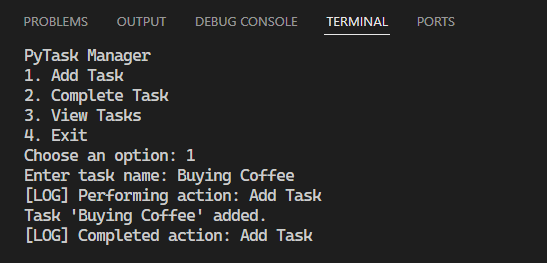

# PYTHON__001__PyTaskManager

## Project Overview 
- **name**: PyTask Manager
- **type**: CLI (Command Line Interface) app 

## Preview



## Description 
- The **primary goal** of this app is to provide an easy way for user to manage their daily tasks.
- It allows users to add, view and mark tasks as completed in an organized manner.

## Benefits
- Keep track of your tasks without relying on external software.
- Maintain productivity by clearly organizing tasks and marking completed ones.

## Tools & Techniques Used
- **Language**: Python (3.12.1)
- **Modules**:
    - ***functools***
        - Used for decorator functionality.
- **Decorators**:
    - ***custom ("log_action")***
        - Implemented to log all actins performed by the user.
        - This decorator uses nested functions to wrap functionality and adds structured logs for better debugging and tracking.
- **Built-in Functions**
    - ***print()***
    - ***input()***
    - ***isInstance()***
    - ***len()***
- **Built-in Types**
    - ***class***
    - ***enumerate***
- **Error Handling**
    - ***try ... except + raise***
    - ***ValueError***
- **Data Types**
    - ***List []*** :
        - Used to store tasks.
        - Each task is a dictionary with keys for the name and completion status.
    - ***Dictionary {}***
        - Each task is represented as a dictionary with fields like 'name' and 'completed'.
- **Running Locally**
    1. Clone or Download the Repository
    2. Set Up a Virtual Environment (Optional)
        ```bash
            python -m venv venv
            venv\Scripts\activate # on Windows
        ```
    3. Install Dependencies
        ```bash
            pip install -r requirements.txt
        ```
    4. Run the Application
        ```
            python main.py
        ```
    5. Enter a number in the terminal
    6. Enjoy! 😊
